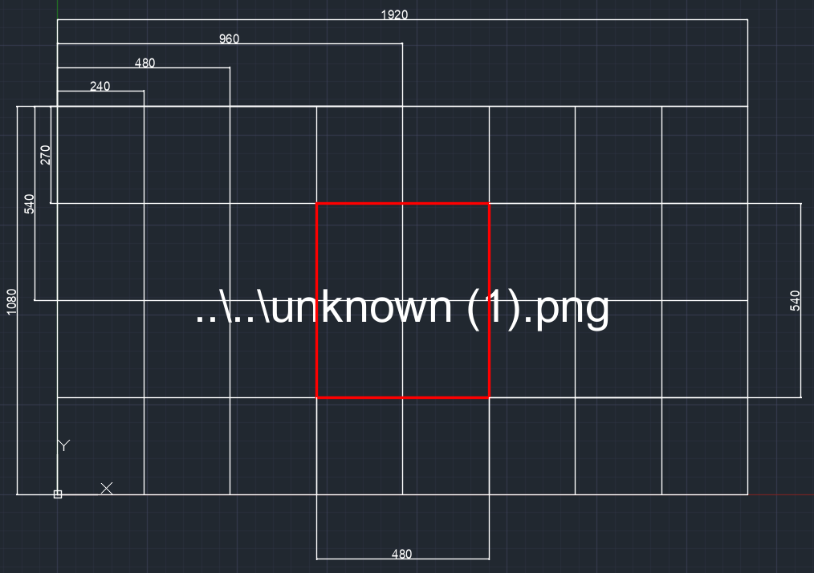

# 🎯 Cod Mod War

**A Python project that uses image processing to detect specific points on the screen and control the mouse position accordingly. Developed for educational, technical development, and entertainment purposes. Currently in beta.**

## 🧠 Purpose

This project is designed for FPS games like Call of Duty: Modern Warfare to detect visual targets within certain areas of the screen and automatically point the mouse cursor at them. Using image processing techniques, it scans a region near the center of the screen and moves the mouse toward the detected target.  
**It is entirely written for technical development, practicing image processing, and improving Python skills.**

## ⚙️ Features

- Scans the central area of the screen (for optimization and speed)  
- Divides the screen into a grid of 32 equal parts  
- Searches for targets within specified grid squares  
- Automatically moves the cursor to the matched target  
- Utilizes image processing and automation techniques  

## 📐 Measurement Grid

To ensure consistent operation across different screen resolutions, the screen is divided into 32 equal parts (4 rows x 8 columns). Only the 4 central grid squares are scanned. This allows fast and effective analysis of the area near the center regardless of screen size. This approach is used for performance optimization and to avoid processing unnecessary areas.



## 🛠️ Technologies Used

- [OpenCV](https://opencv.org/)  
- [NumPy](https://numpy.org/)  
- [MSS](https://github.com/BoboTiG/python-mss)  
- [PyAutoGUI](https://pyautogui.readthedocs.io/)  
- [pywin32](https://github.com/mhammond/pywin32)  
- [PyAutoIt](https://pypi.org/project/PyAutoIt/)  
- [Playsound](https://pypi.org/project/playsound/)  
- [Keyboard](https://pypi.org/project/keyboard/)  
- [Pillow (PIL)](https://python-pillow.org/)  

## 📦 Installation

```bash
pip install opencv-python numpy mss pyautogui pywin32 -U pyautoit playsound keyboard Pillow
